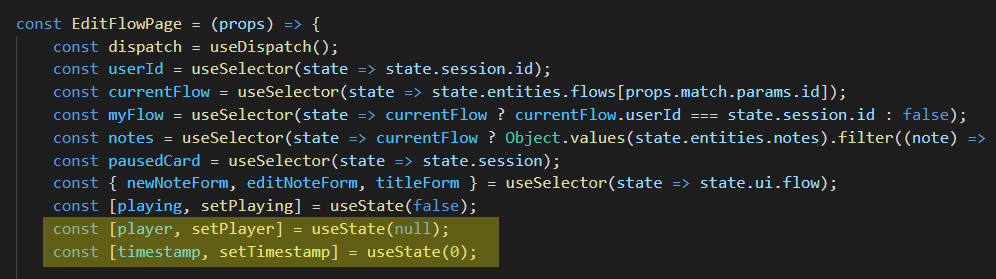
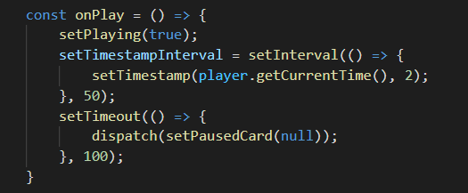
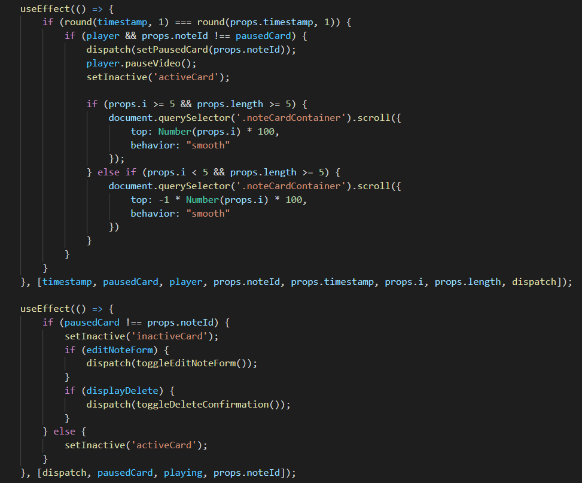
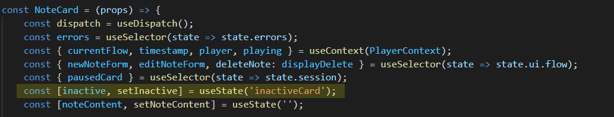
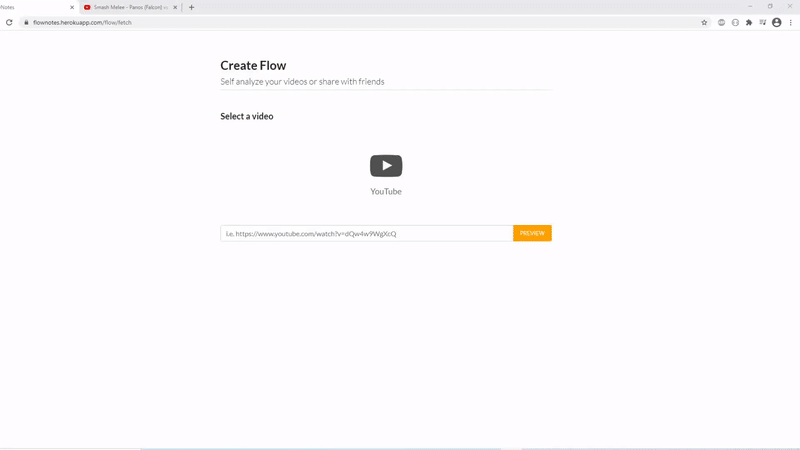
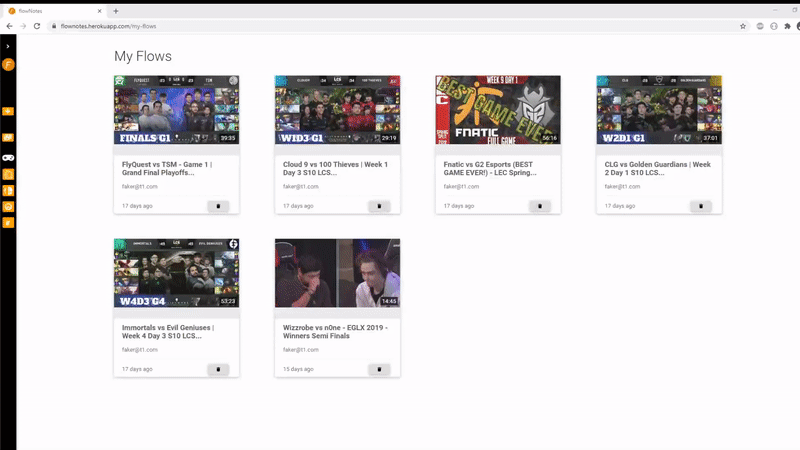

<h2 align="center">The notetaking app built for gamers</h2>

## Table of Contents
* ### [About](#about)
* ### [Features & Demo](#featuresanddemo)
* ### [Code Snippets](#codesnippets)
* ### [Future Features](#futurefeatures)
* ### [Credits](#credits)

<h2 id="about">About</h2>

<a class="logoLink" href="https://flownotes.herokuapp.com"><strong>flowNotes</strong></a> is a fullstack video / notetaking application built in <strong>React / Redux, Express, and PostgreSQL</strong> that aims to give gamers a <em><strong>single hub</strong></em> for analyzing esports footage.

It is a community-driven site which allows a user to interact with other users' content making it a great tool for <em><strong>self-analysis</strong></em>, <em><strong>collaborative learning</strong></em>, and <em><strong>coaching</strong></em>.

<h2 id="featuresanddemo">Features And Demo</h2>

### Auth:
Users can...
* Sign in as a demo user if they don't have an account
* Create an account
* Sign into an existing account

### Flows:
Users can...
* Create a flow
  * Must be a valid YouTube URL
  * Must be assigned a category
  * Can be assigned an optional description
* Rename a flow
* Delete a flow they own
* Not modify or delete a flow they do not own in any way

### Notes:
<li>When a video's timestamp matches a notes, the video for the flow will pause</li>
<li>Clicking on a note will navigate to its timestamp in the video</li>
 
Users can...
<ul>
<li>Add a timestamped note to a flow</li>
<li>Update a note's content</li>
<li>Delete a note</li>
</ul>

### Categories:
* Users can browse flows by category

<h2 id="codesnippets">Code Snippets</h2>

**Notes Pausing Automatically**

On flowNotes, if you have created at least one note for a flow and are rewatching said flow, the app will automatically pause the video and the highlight the note at the associated timestamp. Here's an example:

 

 

The EditFlowPage component houses two pieces of state that are the basis of this functionality. **Playing**, which is a boolean flag signifying the state of whether the video player is playing, and **timestamp**, which is the time in seconds to the second decimal of
the current video.

 

 

The **react-youtube** library's YouTube player component is then passed an onPlay callback that fires any time the player begins playing which sets an interval to set the timestamp every 50ms.

 

 

Finally, the NoteCard component consumes the PlayerContext to have access to the state of the video player. useEffects are then used to fire a callback function any time the timestamp is updated **AND** the player is playing to see if its timestamp matches the player's state. If it does, and the pausedCard is not the card itself, it dispatches to the Redux store to tell it that it is the current paused card and pauses the video.

 

 

The inactive piece of state houses what class name to apply to the card for styling when it is the active paused card.

 

 

...validating youtube video

...sidebar code

<h2 id="futurefeatures">Future Features</h2>

<h2 id="credits">Credits</h2>