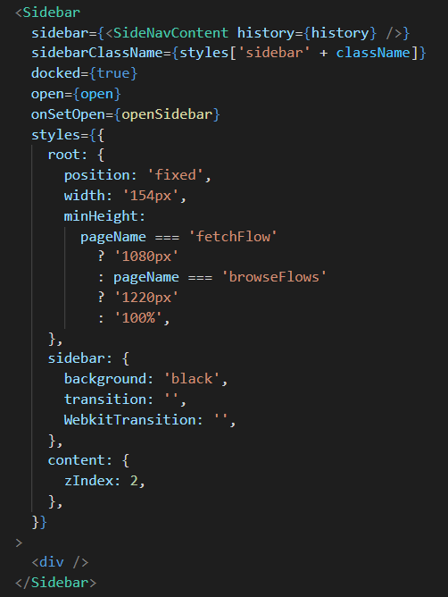

<h2 align="center">The notetaking app built for gamers</h2>

## Table of Contents

- ### [About](#about)
- ### [Features & Demo](#featuresanddemo)
- ### [Code Snippets](#codesnippets)
- ### [Future Features](#futurefeatures)
- ### [Credits](#credits)

<h2 id="about">About</h2>

<a class="logoLink" href="https://flownotes.herokuapp.com"><strong>flowNotes</strong></a> is a full stack video / notetaking application built in <strong>React / Redux, Express, and PostgreSQL</strong> that aims to give gamers a <em><strong>single hub</strong></em> for analyzing esports footage.

It is a community-driven site that allows a user to interact with other users' content making it a great tool for <em><strong>self-analysis</strong></em>, <em><strong>collaborative learning</strong></em>, and <em><strong>coaching</strong></em>.

<h2 id="featuresanddemo">Features And Demo</h2>

### Auth:

Users can...

- Sign in as a demo user if they don't have an account
- Create an account
- Sign into an existing account

### Flows:

Users can...

- Create a flow
  - Must be a valid YouTube URL
  - Must be assigned a category
  - Can be assigned an optional description
- Rename a flow
- Delete a flow they own
- Not modify or delete a flow they do not own in any way

### Notes:

<li>When a video's timestamp matches a notes, the video for the flow will pause</li>
<li>Clicking on a note will navigate to its timestamp in the video</li>
 
Users can...
<ul>
<li>Add a timestamped note to a flow</li>
<li>Update a note's content</li>
<li>Delete a note</li>
</ul>

### Categories:

- Users can browse flows by category

### Demo:

For a look at what using [flowNotes](https://flownotes.herokuapp.com) is normally like, check out this video demonstration by its developer, Panayiotis Dimopoulos!

<h2 id="codesnippets">Code Snippets</h2>

**Notes Pausing Automatically**

On flowNotes, if you have created at least one note for a flow and are rewatching said flow, the app will automatically pause the video and the highlight the note at the associated timestamp. Here's an example:

 

 

The EditFlowPage component houses two pieces of state that are the basis of this functionality. **Playing**, which is a boolean flag signifying the state of whether the video player is playing, and **timestamp**, which is the time in seconds to the second decimal of
the current video.

 

 

The **react-youtube** library's YouTube player component is then passed an onPlay callback that fires any time the player begins playing which sets an interval to set the timestamp every 50ms.

 

 

Finally, the NoteCard component consumes the PlayerContext to have access to the state of the video player. useEffects are then used to fire a callback function any time the timestamp is updated **AND** the player is playing to see if its timestamp matches the player's state. If it does, and the pausedCard is not the card itself, it dispatches to the Redux store to tell it that it is the current paused card and pauses the video.

 

 

The inactive piece of state houses what class name to apply to the card for styling when it is the active paused card.

 

 

**Validating a YouTube URL on Flow Creation**

On flowNotes, when a user creates a new flow they are met with a validation error if the link they provide is not a valid YouTube URL. Here's an example:

 

 

The FetchFlowForm component houses a controlled component that subscribes to the url slice of state. On submit the form sends an AJAX request to the Express backend via a Redux thunk

 

 

The backend then uses a mixture of the **express-validator** library, a regular expression to check if the URL provided is a valid YouTube URL, and a custom **handleValidationErrors** middleware to return the error to the client if the URL provided by the user is not a valid YouTube URL

 

 

**Navigating flowNotes with the sidebar**

On flowNotes, you can use a toggleable sidebar to navigate around various portions of the site. Here's an example:

 

 

The SideNavComponent houses the two slices of state, as well as a handler, to manage the state and styling of the Sidebar component from the **react-sidebar** library. The className and openSidebar handler are passed through a context so nested child components of the SideNavComponent can access them.

 

 

Next, the Sidebar component from the **react-sidebar** receives some custom styling provided by its styles prop which merges with its default styling to seamlessly integrate it into the site. All of the sidebar's content is passed into the Sidebar component's sidebar prop.

 

 

Finally, the SideNavContent component houses a collection of Link components from the **react-router-dom** library to route the different buttons on the sidebar to different portions of the site. Some CSS transitions are additionally applied to animate the sidebar opening and closing.

 

 

<h2 id="futurefeatures">Future Features</h2>

- Fully Responsive Design _currently only optimized for larger screens_
- Drawings
- Sharing flows with other users so they can create notes and drawings on your flow

<h2 id="credits">Credits</h2>

- Rounding utility function from [https://www.jacklmoore.com/notes/rounding-in-javascript/](https://www.jacklmoore.com/notes/rounding-in-javascript/)
- react-youtube library [https://www.npmjs.com/package/react-youtube](https://www.npmjs.com/package/react-youtube)
- react-sidebar library [https://www.npmjs.com/package/react-sidebar](https://www.npmjs.com/package/react-sidebar)
- MDBReact [https://www.npmjs.com/package/mdbreact](https://www.npmjs.com/package/mdbreact)
